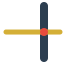

# OBA Opticsworkbench v 0.5.1

---

OBA Optics Workbench is a FreeCAD-based environment focused on optical analysis and ray-based simulation within the OBA ecosystem.

The workbench provides a reactive workflow where changes to geometry or parameters are immediately reflected in the ray tracing results. This makes it well suited for exploring and understanding the behavior of optical systems such as lenses, mirrors, and detectors.

It includes tools for scanning, evaluating, and visualizing optical interactions, enabling efficient analysis and rapid iteration of designs

While this workbench focuses on 3D optical systems, the original **OpticsWorkbench** by **chbergmann** remains a strong choice for 2D and planar use cases.

The original Optical Workbench can be found here:
https://github.com/chbergmann/OpticsWorkbench

## Changelog

---

### Version 0.1

- Added a semi‑transparent **reference (ghost) plane** to density and cluster plots to visually indicate the active projection plane.
- Fixed performance issues causing slow redraws in the 3D view.

### Version 0.2

- Power‑vs‑Hit analysis plot
- Revised power model with explicit energy bookkeeping
- Automatic target‑based labeling of optical objects

### Version 0.3

- Fixed transformation handling so that changes applied to `PartDesign::Body` correctly update `_affected_optical_objects` and retrigger ray tracing.
- Fixed cluster plot filtering to correctly use the composite key:
  `(optical_object, bounce_count, prev_hit_label)`.
- Fixed absorber behavior:
  absorbers now attenuate rays when absorption < 1.0, instead of acting as a pure sink.
- Improved generation of optical object names to ensure consistent and clear representation in the TreeView.
- Fixed scanner logic so that objects with Placement controlled by expressions  
  (e.g. `Spreadsheet`, `ExpressionEngine`) are handled correctly.
- Extended Heatmap Viewer with interactive surface picking, profile linking, and direct object offset replay.

### Version 0.4

- Heatmap: clicking the surface now updates the database selection
- RayConfig:
  - Added `RunMode` (Manual / Auto)
  - Tracing can now be triggered via interaction (e.g. click)
- RayConfig:
  - Added checkbox to enable trace logging in the FreeCAD console  
    (requires **Display message types → Log messages** to be enabled)
- Density & Cluster plots:
  - Filter panel now displays _labels_ instead of object names
- Density Plot:
  - Added axis flip option
- New optical object:
  - `Detector` (passive hit observer) 
- Builders:
  - Added builder tools for creating optical geometry

### Version 0.5

- Major overhaul of the scanner
  - Improved stability and consistency in object movement handling
  - Refactored scan workflow (offset → trace → store)

### Version 0.5.1

- Buggfix for click in 2d heatmap in scanner function

### Version 0.6

- Fix: Correct handling of global ray max length across bounces
- Power vs Hit Plot: Improved user experience and more metrics
- Heatmap viewer : Added run and commit buttons
- Introduced a new geometry construction system **(Experimental)** 

# 🔧 Installation

---


<hr style="clear: both;">

    To install, unzip and copy the content into FreeCAD’s Mod folder.
    Typical location on Windows:

    ```
    C:\Users\<username>\AppData\Roaming\FreeCAD\v1-1\Mod\OBA_OpticsWorkbench\

    ```

# Optical objects

---

Interactive optical components used for building and tracing optical systems.  
These objects define how rays are emitted, transformed, and detected.

### [ Beam](docs/optical_objects.md#beam)

Directional point source for controlled ray emission.

### [ Emitter](docs/optical_objects.md#emitter)

Surface-based emitter distributing rays across geometry.

### [ Mirror](docs/optical_objects.md#mirror)

Reflective optical surface with configurable reflection properties

### [ Absorber](docs/optical_objects.md#absorber)

Absorbs a portion or all of incoming ray power.

### [ Detector](docs/optical_objects.md#detector)

Captures ray interactions for analysis and visualization.

### [ Lens](docs/optical_objects.md#lens)

Refractive optical element for bending and focusing rays.

### [ Grating](docs/optical_objects.md#grating)

Diffractive surface that splits rays based on wavelength.

### [ Ray config](docs/optical_objects.md#rayconfig)

Global configuration controlling ray tracing and visualization.

# Plots

---

Visualization and analysis tools for inspecting ray behavior after tracing.  
These tools do not affect the simulation itself but help interpret results.

### [ Bounce Range](docs/plots.md#bouncerangedialog)

Filter and inspect ray segments based on bounce index.

### [ Density Plot](docs/plots.md#densityplot)

Visualizes spatial distribution of ray power.

### [ Cluster Plot](docs/plots.md#rayclusterplot)

Groups ray hits into clusters and highlights structure.

### [ Power vs Hit](docs/plots.md#power-vs-hit-plot)

Shows how ray power evolves across interactions.

# Scanner

---

### [ Scanner](docs/scanner.md#scanner)

### [ HeatmapPlot](docs/scanner.md#heatmapplot)

# Examples

---

## Herriot cell


<!-- <br clear="all"> -->

## Prisma


<hr style="clear: both;">

_Spectral ray tracing through a prism. Rays are color‑coded by wavelength, showing continuous chromatic dispersion and high‑density beam propagation._
For this example, **Mesh tracing** is used, enabling tens of thousands of rays to be traced efficiently.
Compared to **OCC tracing**, Mesh mode trades exact surface precision for significantly improved performance, which is often preferable for spectral dispersion, power density analysis, and statistical ray studies.

## License

GNU Lesser General Public License v3.0 ([LICENSE](LICENSE))
