### Why another optics workbench you say…

### ... Its because it’s different, that’s why.

Before anything else, I want to give a shout‑out to **chbergmann** for the original **Optical Workbench**. That project has been the primary inspiration for this work and laid the foundation for many of the ideas developed further here.

The original Optical Workbench can be found here:
https://github.com/chbergmann/OpticsWorkbench

### Version 0.1

#### Changelog

- Added a semi‑transparent **reference (ghost) plane** to density and cluster plots to visually indicate the active projection plane.
- Fixed performance issues causing slow redraws in the 3D view.

## 🔧 Installation

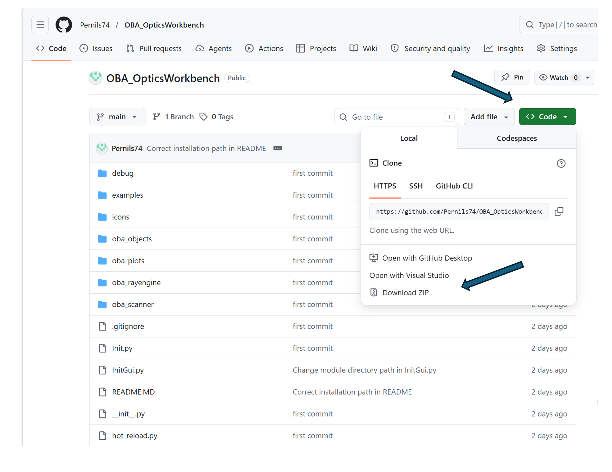

    To install, unzip and copy the content into FreeCAD’s Mod folder.
    Typical location on Windows:

    ```
    C:\Users\<username>\AppData\Roaming\FreeCAD\v1-1\Mod\OBA_OpticsWorkbench\

    ```

## 🧩 Surface‑based optics (ShapeBinders)

    The workbench leverages FreeCAD **ShapeBinders** to reference geometry faces.

    When creating an optical element, selected faces are converted into
    ShapeBinders and used as the active optical surfaces. The ray tracer operates
    entirely on these references, keeping the optical model decoupled from the
    source geometry.

    Optical surfaces may be added either during creation by selecting faces, or
    later through the settings dialog. The dialog displays all referenced surfaces;
    clicking a surface entry removes that surface from the optical element.

<!-- ................ Emitter ................... -->


## 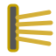 Emitter

- `Lambertian` Applies cosine-based angular weighting to ray power distribution.

- `Flip normal` Inverts the surface normal used for emission. Useful if geometry normals point in the wrong direction

- `Spread angle` Angular spread of emitted rays. Spread is applied around the surface normal

- `Power` Total emitted optical power.

- `Max rays` Maximum number of rays generated. The final ray count may be reduced by `isInside` filtering.

- `Wavelength` Central wavelength of the emitted rays.

- `Max bounce` Maximum number of surface interactions per ray.

- `Max ray length` Maximum propagation distance of each ray. Rays are terminated after exceeding this length

- `Preview ray length` Length of the ray segments shown in preview mode.

- `Linked surfaces` Lists all geometry faces linked to the mirror via **ShapeBinder**.

<hr style="clear: both;">

<!-- ................ Beam ................... -->

##  Beam

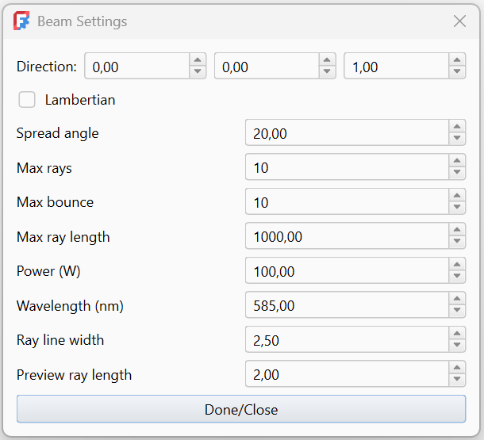

- `Direction` Use the spinbox or the translation funciton in 3d view

- `Lambertian` Applies cosine-based angular weighting to ray power distribution.

- `Spread angle` Angular spread of emitted rays. Spread is applied around the surface normal

- `Max rays` Maximum number of rays generated. The final ray count may be reduced by `isInside` filtering.

- `Max bounce` Maximum number of surface interactions per ray.

- `Max ray length` Maximum propagation distance of each ray. Rays are terminated after exceeding this length

- `Power` Total emitted optical power.

- `Wavelength` Central wavelength of the emitted rays.

- `Preview length` Length of the ray segments shown in preview mode.

- `Ray line width` Visual thickness of the rendered ray lines.

- `Linked surfaces` Lists all geometry faces linked to the mirror via **ShapeBinder**.

<hr style="clear: both;">

<!-- ................ Mirror ................... -->


##  Mirror

- `Reflectivity` **Range:** 0.0 – 1.0. `1.0` means a perfect mirror (all light is reflected)

- `Transmissivity` - **Range:** 0.0 – 1.0. Used to model semi‑transparent or beam‑splitting surfaces

- `Linked surfaces` Lists all geometry faces linked to the mirror via **ShapeBinder**.

<hr style="clear: both;">

<!-- ................ Mirror ................... -->

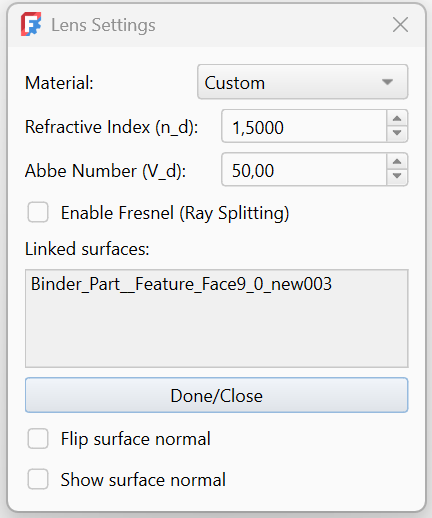

##  Lens

- `Material` Material preset for the lens. Materials are pushed on entry and popped on exit, relative to the surface normal.

- `Flip surface normal` Inverts the surface normal used for optical calculations.

- `Show surface normal` Displays a visual preview of the surface normal. Debug tool for checking normal orientation

- `Refractive index` Refractive index (n) of the lens material. Must be greater than 1.0. Default: 1.50

- `Enable Fresnel` Enables Fresnel‑based reflection and transmission.

- `Abbe Number` Controls chromatic dispersion of the lens material.

- `Linked surfaces` Lists all geometry faces linked to the mirror via **ShapeBinder**.

<hr style="clear: both;">

<!-- ................ Absorber ................... -->


## 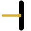 Absorber

- `Absorption` Fraction of ray power absorbed by the surface (0.0–1.0).

- `Linked surfaces` Lists all geometry faces linked to the mirror via **ShapeBinder**.

<hr style="clear: both;">

<!-- ................ Grating ................... -->

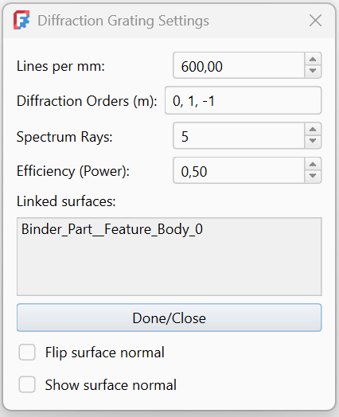

## 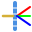 Grating

- `Lines per mm` Number of grooves per millimeter of the grating.

- `Orders` Diffraction orders to simulate. Specified as a list of integers (e.g. 0, 1, -1)

- `Spectrum rays` Number of rays generated for spectral splitting per diffraction order.

- `Efficiency (power)`Simplified diffraction efficiency per order. Range: 0.0 – 1.0

- `Show surface normal` Displays a visual preview of the surface normal. Debug tool for checking normal orientation

- `Flip normal` Inverts the surface normal used for optical computation.

- `Linked surfaces` Lists all geometry faces linked to the mirror via **ShapeBinder**.

<hr style="clear: both;">

<!-- ................ RayConfig ................... -->


##  RayConfig

> ⚠️ **Required for tracing**
> A RayConfig object must exist in the document tree for ray tracing and visualization to work.  
> If no RayConfig is present, no rays will be traced or displayed.

- `Trace mode` Mesh — triangle‑based ray tracing **_(default)_** ,OCC — OpenCASCADE analytic geometry tracing

- `Disable debounce` Disables automatic trace debouncing

- `Mesh tolerance` Controls mesh resolution used for ray tracing.

- `Mesh ray multiplier` Multiplier applied to ray count when using **_mesh_** tracing.

- `Scene isolation` Isolates the active optical scene.

- `Color By Bounce` Colors rays according to bounce count.

- `Bounce min / Bounce max` Limits which ray segments are visible.

- `Show mesh` Displays mesh triangles used for ray tracing **_(debug)_**.

- `Show vertex normals` Displays vertex normals for mesh geometry **_(debug)_**.

- `Vertex normal length` Length of displayed vertex normals **_(debug)_**.

- `Create ray paths object` Creates a FreeCAD object containing the traced ray geometry.

- `Remove ray paths object` Removes the generated ray geometry object from the document.

<hr style="clear: both;">

<!-- ................ BounceRangeDialog ................... -->

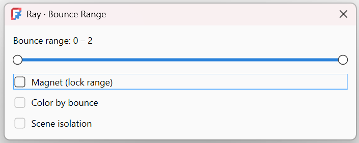

##  BounceRangeDialog

The Bounce Range dialog provides interactive control over which ray bounces are visualized in the scene.
It operates purely on ray visualization and does not affect ray tracing results.

### Bounce Range Slider

    Selects the range of ray bounce indices to display.

        - The left handle sets minimum bounce index
        - The right handle sets maximum bounce index

    Only ray segments within this range are rendered

### Magnet (Lock Range)

    When enabled, the selected bounce range is locked.

    Moving one handle moves the entire range

    The range width is preserved

    Prevents accidental resizing when scanning through bounces

    Useful for inspecting successive bounce layers.

### Color by Bounce

    Colors rays according to their bounce count.

    Each bounce index receives a distinct color

    Helps visualize reflection depth and ray complexity

    Matches the global ColorByBounce setting in RayConfig

    Visualization only — no optical effect.

### Scene Isolation

    Isolates the optical scene during visualization.

    Non‑optical objects are hidden

    Improves clarity in complex documents

    Matches the global SceneIsolation setting in RayConfig

<hr style="clear: both;">

<!-- ................ Density Plot ................... -->


## 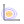 DensityPlot

    The Power Density Plot visualizes how ray power is distributed over space based on ray hit data.
    It operates on already traced rays and performs no ray tracing itself.

### Plane

    Selects the projection plane for 2D plots.

    XY
    XZ
    YZ

    Hit points are orthogonally projected onto the selected plane.

### Power

    Selects which power quantity to visualize.

    Power In — incoming ray power at the hit
    Power Out — remaining ray power after interaction

### Bins

    Number of bins used for the 2D histogram.

    Higher values increase spatial resolution
    Lower values produce smoother, coarser plots
    Typical range: 50 – 200

### σ (Gaussian smoothing)

    Applies Gaussian filtering to the power density map.

    0.0 disables smoothing
    Higher values smooth noise and sampling artifacts
    Uses a 2D Gaussian kernel

### Log

    Applies logarithmic scaling to the power density.

    Useful for large dynamic ranges
    Helps reveal low‑intensity regions
    A small offset is added internally to avoid log(0)

### Equal

    Forces equal axis scaling.

    Preserves geometric proportions
    Recommended for accurate spatial interpretation

### Grid

    Displays a grid overlay on the plot.

    Visualization aid only

### Show Filter

    Shows or hides the Hit Filter Panel.
    The filter panel allows limiting data by:

    - Emitters
    - Optical objects

### 3D

    Enables 3D visualization of ray hit points.

    Displays hit points in full XYZ space
    Points are grouped and color‑coded by object
    A legend is generated automatically

### XYZ List

    Opens a live list of hit coordinates.

    Displays raw (x, y, z) values
    Useful for inspection, debugging, or export

<hr style="clear: both;">

---

<!-- ................ Density Plot ................... -->


##  RayClusterPlot

    The Cluster Plot tool provides advanced visualization of ray hit distributions, including clustering, centroids, and optional 3D views.
    It is designed for analysis and debugging of ray behavior rather than physical simulation.

### Plane

    Selects the projection plane for 2D visualization:

    XY
    XZ
    YZ

    Hit coordinates are projected orthogonally.

### Flip

    Flips the 2D projection axes.

    Useful for matching different coordinate conventions
    Visualization only

### Grid

    Toggles a grid overlay on the plot.

### Equal

    Forces equal axis scaling.    Preserves geometric proportions

### Blobs

    Enables 2D clustering visualization.    Displays density‑based blob regions

### Smooth

    Applies smoothing to blob visualization.   Reduces sampling noise

### Centroids

    Displays cluster centroids. Each centroid represents the average hit position

### Show Filter

    Shows or hides the Hit Filter Panel.
    Filters allow limiting hits by:

    - Emitters
    - Optical objects

### 3D

    Enables 3D visualization of ray hit points.

    Displays hits in full XYZ space. Points are grouped and color‑coded by object

### XYZ List

    Opens a live list of hit coordinates.

    Displays raw (x, y, z) values
    Useful for inspection, debugging, or export

<hr style="clear: both;">

<!-- ................ Scanner Batch Dialog ................... -->

##  Scanner

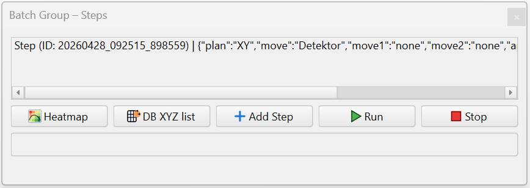

    The Batch Group tool allows running multiple simulation steps sequentially, typically for parameter scans, rotations, or systematic sweeps.
    A Batch Group is stored as an object in the document tree and managed through a dockable panel.

- `Add Step` Creates a new Step object and opens the Step Edit dialog.

- `Run` Executes all active steps in sequence.

- `Stop` Stops the batch execution gracefully.

- `Heatmap` Opens the Heatmap Viewer for inspecting accumulated batch results.

- `DB XYZ List` Opens a list view of stored XYZ scan data.

<hr style="clear: both;">

<!-- ................ Scanner Step Dialog ................... -->


    The Step Edit dialog is used to define and edit a single Batch Step within a Batch Group.
    Each step describes one scan or transformation operation applied during batch execution.

- `Move Targets`
  Defines which objects are affected by the step.
  Move Target / Move Target 1 / Move Target 2
  Select up to three objects to be moved or scanned.
  At least one target must be selected

- `Plane` Selects the primary scan plane:
  XY
  XZ
  YZ

  The selected plane also determines the default rotation axis.

#### Sweep Parameters

- `Range` 1 – 360. Controls angular resolution

- `From Radius` Start radius of the scan.

- `To Radius` End radius of the scan.

- `Radius Steps` Number of radial steps between start and end radius.

- `Rotation Axis` Axis around which extra rotation is applied. Automatically synchronized with the selected plane.

- `Rotation (°)` Fixed rotation angle applied to the target.

> Data is stored in a SQLite database file located in the same directory as the installed module folder.  
> This file is created automatically and persists between sessions.

<!-- ................ Scanner Heatmap plot ................... -->

## 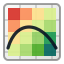 HeatmapPlot

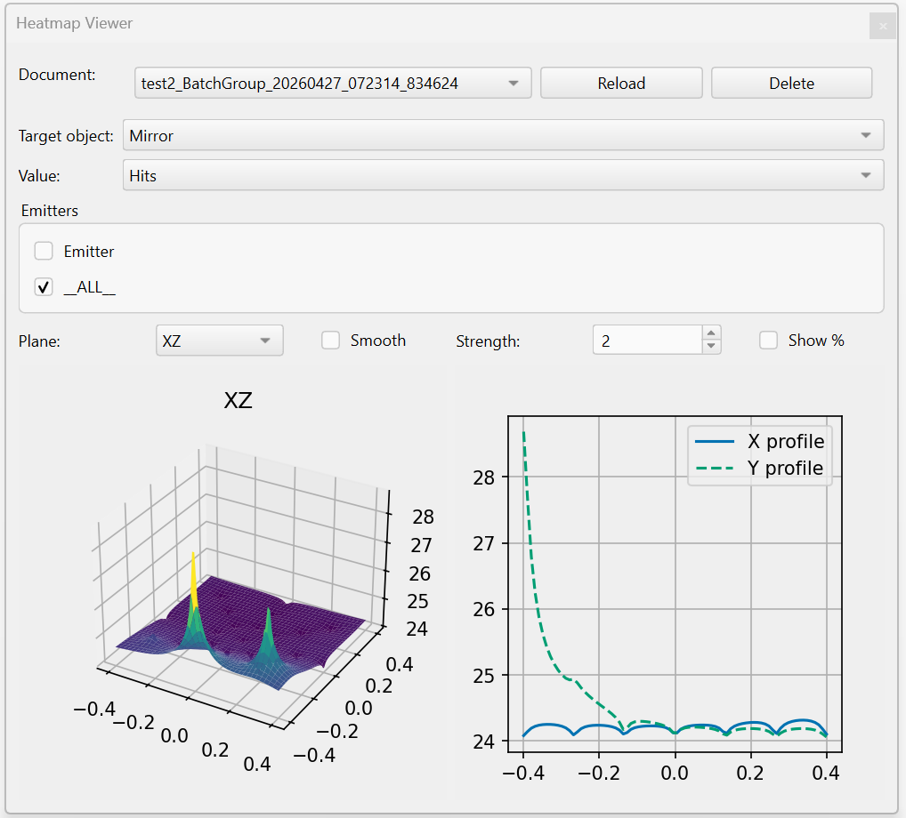

    The Heatmap Viewer provides post‑processing visualization of batch scan results stored in the local database.
    It is primarily used to analyze absorber hits and accumulated beam power over scanned parameter spaces.

- `Reload` Reloads document structure from the database

- `Delete`Permanently removes the selected document from the database

- `Target Object` Selects the scanned target object.

- `Value` Selects which quantity is visualized. Hits — number of ray hits. Power In — incoming power at the hit. Power Out — remaining power after interaction.

- `Emitters` Lists all emitters associated with the selected document and target.

### Plot Options

- `Plane` Selects projection plane:

- `Smooth` Enables spatial smoothing of the data.

- `Strength` Controls smoothing strength.

- `Show %` Normalizes values to percentage of the maximum.

### Visualization

    Heatmap Surface (3D)

    Displays a 3D surface plot of the selected value
    Height represents accumulated value
    Color map: viridis
    Updated dynamically on data or option changes

#### Profiles

    Displays cross‑sectional profiles through the heatmap:

    X profile — center row
    Y profile — center column

    Useful for:

    Spot size estimation
    Alignment checks
    Symmetry analysis

<hr style="clear: both;">

<!-- ................ LiveSheet ................... -->

##  LiveSheet


    Edit spreadsheet values directly in a docked table
    Trigger document recomputation automatically on change
    Enable fast, interactive parameter studies
    Avoid opening the standard spreadsheet editor
    Support optical workflows requiring frequent updates

## Examples

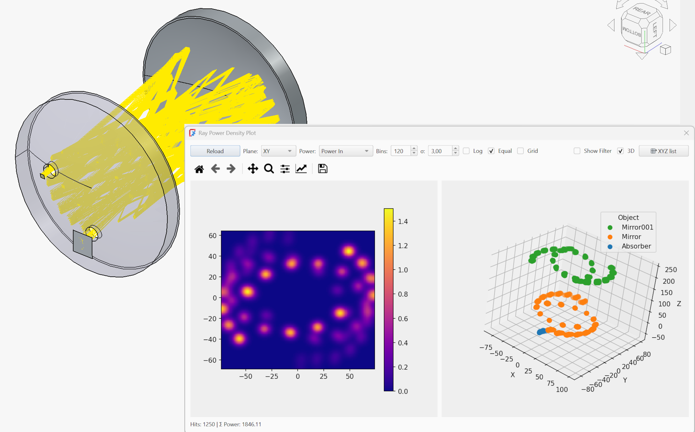

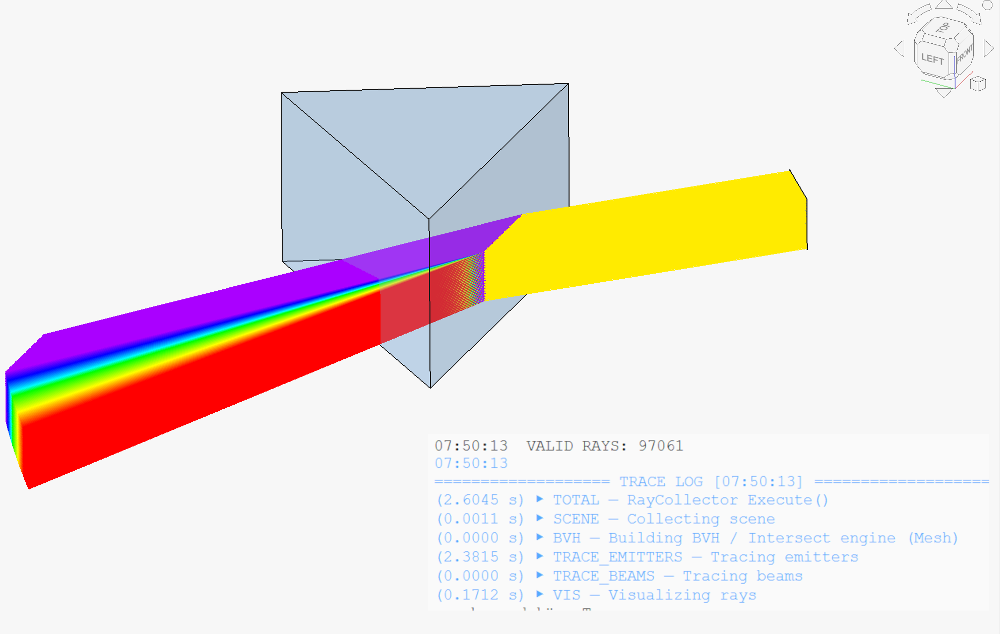

_Spectral ray tracing through a prism. Rays are color‑coded by wavelength, showing continuous chromatic dispersion and high‑density beam propagation._
For this example, **Mesh tracing** is used, enabling tens of thousands of rays to be traced efficiently.
Compared to **OCC tracing**, Mesh mode trades exact surface precision for significantly improved performance, which is often preferable for spectral dispersion, power density analysis, and statistical ray studies.

## License

GNU Lesser General Public License v3.0 ([LICENSE](LICENSE))
