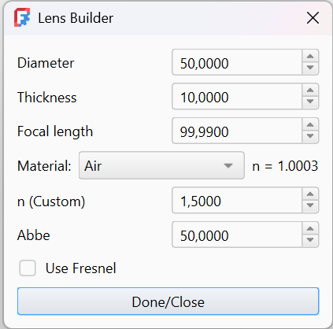
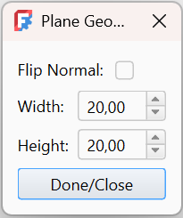
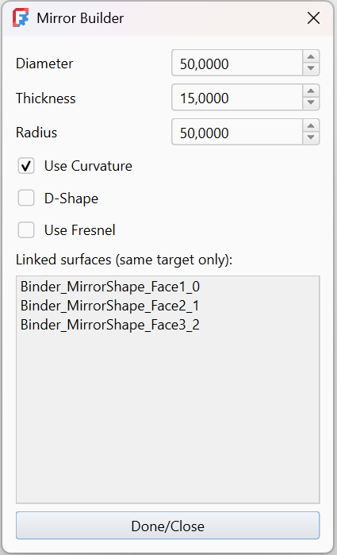

<!-- ................ Lens builder ................... -->

##  Lensbuilder

- `Diameter` Diameter of the lens aperture.

- `Thickness` Distance between the front and back surfaces.

- `Focal length` Calculated focal length of the lens.

- `Material` Select predefined optical material (n is shown next to it).

- `n (Custom)` Manual refractive index override.

- `Abbe` Controls dispersion (affects wavelength-dependent refraction).

- `Use Fresnel` Enables angle-dependent reflection instead of ideal (100%) reflection.

<!--  

<!-- ................ Plane builder ................... -->

##  Planebuilder

- `Width` Width of the plane (X direction).

- `Height` Height of the plane (Y direction).

- `FlipNormal` Reverses the orientation of the surface normal.

The Plane Builder creates a flat surface that can be used as a base for optical elements such as mirrors, detectors, or lenses.

<!-- ................ Mirror builder ................... -->

##  Mirror Builder

- `Diameter` Diameter of the mirror aperture.

- `Thickness` Physical thickness of the mirror body.

- `Radius` Radius of curvature. Controls how strongly the mirror focuses or diverges rays.

- `Use Curvature` Enables curved mirror geometry. When disabled, the mirror becomes flat.

- `D-Shape` Cuts the mirror into a D-shaped aperture.

- `Use Fresnel` Enables angle-dependent reflection instead of ideal reflection.

- `Linked surfaces` Lists all faces that belong to the same mirror object and share optical behavior.

The Mirror Builder creates reflective surfaces that can be flat or curved.  
Curved mirrors can be used to focus, collimate, or redirect light.

