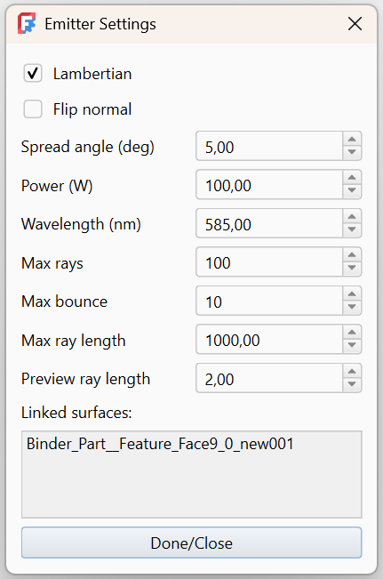
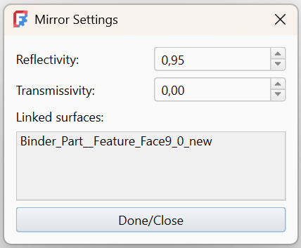
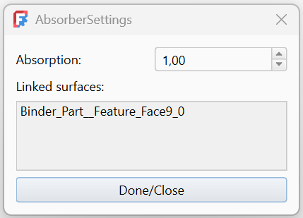
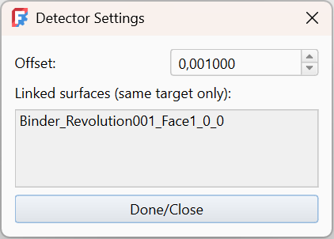
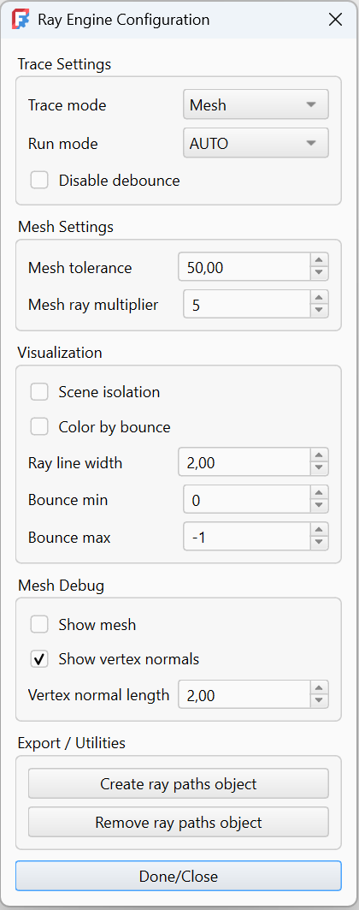

## 🧩 Surface‑based optics (ShapeBinders)

    The workbench leverages FreeCAD **ShapeBinders** to reference geometry faces.

    When creating an optical element, selected faces are converted into
    ShapeBinders and used as the active optical surfaces. The ray tracer operates
    entirely on these references, keeping the optical model decoupled from the
    source geometry.

    Optical surfaces may be added either during creation by selecting faces, or
    later through the settings dialog. The dialog displays all referenced surfaces;
    clicking a surface entry removes that surface from the optical element.

<!-- ................ Emitter ................... -->

##  Emitter

- `Lambertian` Applies cosine-based angular weighting to ray power distribution.

- `Flip normal` Inverts the surface normal used for emission. Useful if geometry normals point in the wrong direction

- `Spread angle` Angular spread of emitted rays. Spread is applied around the surface normal

- `Power` Total emitted optical power.

- `Max rays` Maximum number of rays generated. The final ray count may be reduced by `isInside` filtering.

- `Wavelength` Central wavelength of the emitted rays.

- `Max bounce` Maximum number of surface interactions per ray.

- `Max ray length` Maximum propagation distance of each ray. Rays are terminated after exceeding this length

- `Preview ray length` Length of the ray segments shown in preview mode.

- `Linked surfaces` Lists all geometry faces linked to the mirror via **ShapeBinder**.

<!-- ................ Beam ................... -->

##  Beam

- `Direction` Use the spinbox or the translation funciton in 3d view

- `Lambertian` Applies cosine-based angular weighting to ray power distribution.

- `Spread angle` Angular spread of emitted rays. Spread is applied around the surface normal

- `Max rays` Maximum number of rays generated. The final ray count may be reduced by `isInside` filtering.

- `Max bounce` Maximum number of surface interactions per ray.

- `Max ray length` Maximum propagation distance of each ray. Rays are terminated after exceeding this length

- `Power` Total emitted optical power.

- `Wavelength` Central wavelength of the emitted rays.

- `Preview length` Length of the ray segments shown in preview mode.

- `Ray line width` Visual thickness of the rendered ray lines.

<!-- ................ Mirror ................... -->

##  Mirror

- `Reflectivity` **Range:** 0.0 – 1.0. `1.0` means a perfect mirror (all light is reflected)

- `Transmissivity` - **Range:** 0.0 – 1.0. Used to model semi‑transparent or beam‑splitting surfaces

- `Linked surfaces` Lists all geometry faces linked to the mirror via **ShapeBinder**.

<!-- ................ Lens ................... -->

##  Lens

- `Material` Material preset for the lens. Materials are pushed on entry and popped on exit, relative to the surface normal.

- `Flip surface normal` Inverts the surface normal used for optical calculations.

- `Show surface normal` Displays a visual preview of the surface normal. Debug tool for checking normal orientation

- `Refractive index` Refractive index (n) of the lens material. Must be greater than 1.0. Default: 1.50

- `Enable Fresnel` Enables Fresnel‑based reflection and transmission.

- `Abbe Number` Controls chromatic dispersion of the lens material.

- `Linked surfaces` Lists all geometry faces linked to the lens via **ShapeBinder**.

<!-- ................ Absorber ................... -->

##  Absorber

- `Absorption` Fraction of ray power absorbed by the surface (0.0–1.0).

- `Linked surfaces` Lists all geometry faces linked to the absorber via **ShapeBinder**.

<!-- ................ Detector ................... -->

##  Detector

- `Offset` Distance along the surface normal used to slightly offset the detector geometry.
  This helps avoid self-intersection or numerical issues when rays hit the surface.

- `Linked surfaces` Lists all geometry faces linked to the detector via **ShapeBinder**.

<!-- ................ Grating ................... -->

##  Grating

- `Lines per mm` Number of grooves per millimeter of the grating.

- `Orders` Diffraction orders to simulate. Specified as a list of integers (e.g. 0, 1, -1)

- `Spectrum rays` Number of rays generated for spectral splitting per diffraction order.

- `Efficiency (power)`Simplified diffraction efficiency per order. Range: 0.0 – 1.0

- `Show surface normal` Displays a visual preview of the surface normal. Debug tool for checking normal orientation

- `Flip normal` Inverts the surface normal used for optical computation.

- `Linked surfaces` Lists all geometry faces linked to the mirror via **ShapeBinder**.

<!-- ................ RayConfig ................... -->

##  RayConfig

> ⚠️ **Required for tracing**
> A RayConfig object must exist in the document tree for ray tracing and visualization to work.  
> If no RayConfig is present, no rays will be traced or displayed.

- `Trace mode` Mesh — triangle‑based ray tracing **_(default)_** ,OCC — OpenCASCADE analytic geometry tracing

- `Run mode`
  - **AUTO** — Ray tracing is triggered automatically by changes in the document (geometry edits, property changes, etc.).  
    Recommended for interactive work.

  - **MANUAL** — Automatic tracing is disabled.  
    Tracing must be triggered explicitly (used by batch processing, scanners, and scripted workflows).

    💡 Rays can still be updated manually by creating or reopening the RayConfig object.

- `Disable debounce` Disables automatic trace debouncing

- `Mesh tolerance` Controls mesh resolution used for ray tracing.

- `Mesh ray multiplier` Multiplier applied to ray count when using **_mesh_** tracing.

- `Scene isolation` Isolates the active optical scene.

- `Color By Bounce` Colors rays according to bounce count.

- `Bounce min / Bounce max` Limits which ray segments are visible.

- `Show mesh` Displays mesh triangles used for ray tracing **_(debug)_**.

- `Show vertex normals` Displays vertex normals for mesh geometry **_(debug)_**.

- `Vertex normal length` Length of displayed vertex normals **_(debug)_**.

- `Create ray paths object` Creates a FreeCAD object containing the traced ray geometry.

- `Remove ray paths object` Removes the generated ray geometry object from the document.

