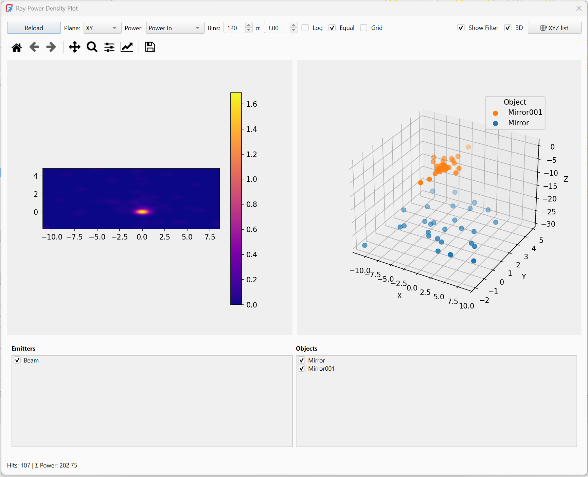
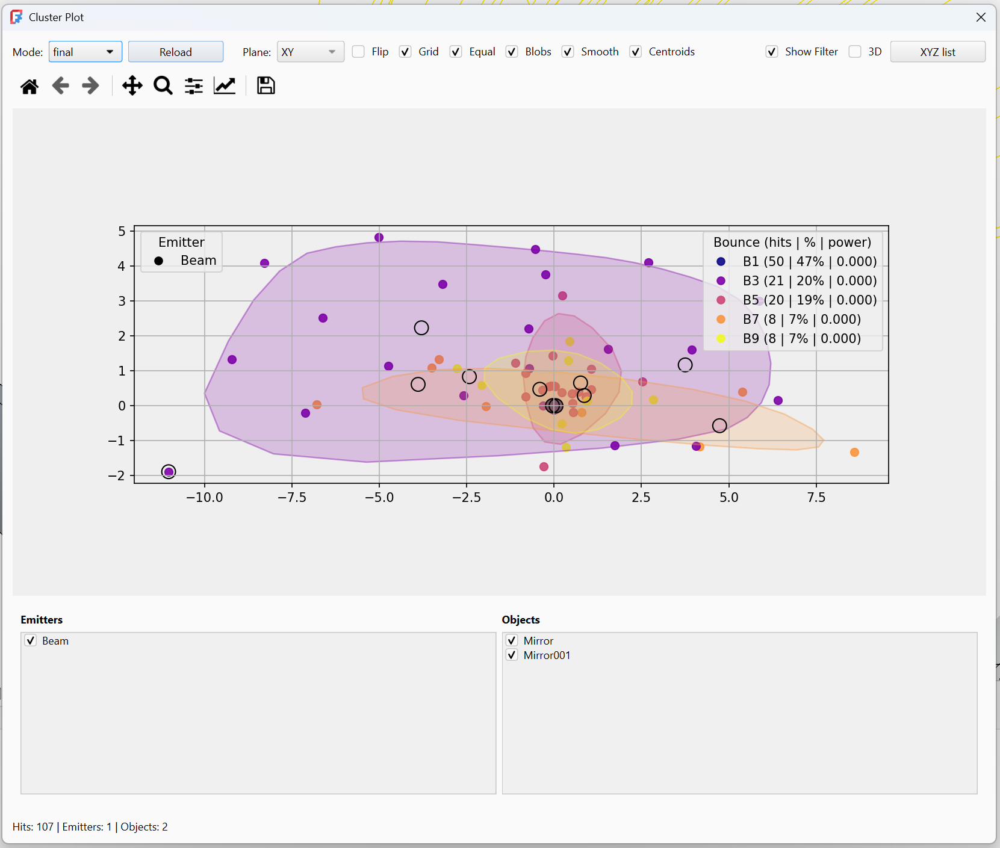
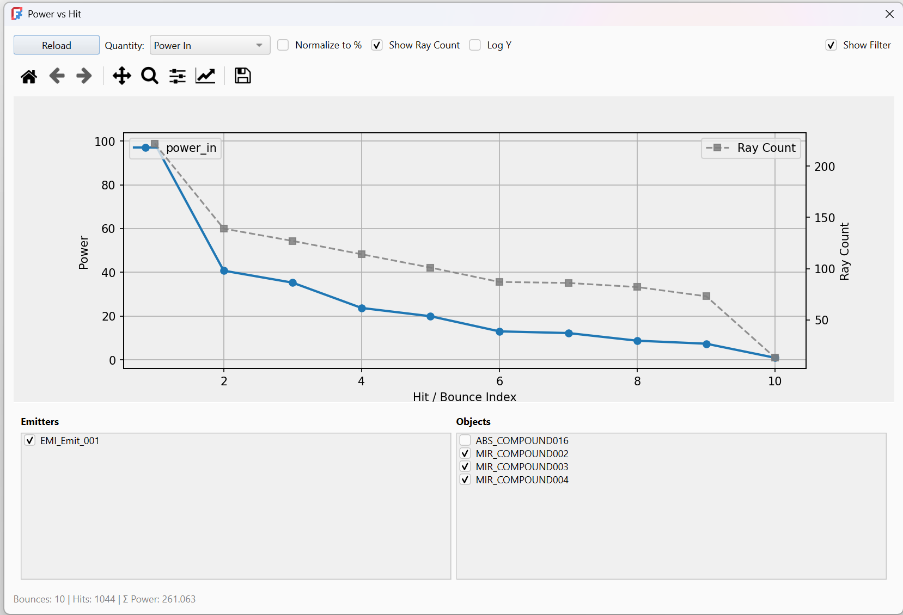

<!-- ................ BounceRangeDialog ................... -->

##  BounceRangeDialog

The Bounce Range dialog provides interactive control over which ray bounces are visualized in the scene.
It operates purely on ray visualization and does not affect ray tracing results.

### Bounce Range Slider

    Selects the range of ray bounce indices to display.

        - The left handle sets minimum bounce index
        - The right handle sets maximum bounce index

    Only ray segments within this range are rendered

### Magnet (Lock Range)

    When enabled, the selected bounce range is locked.

    Moving one handle moves the entire range

    The range width is preserved

    Prevents accidental resizing when scanning through bounces

    Useful for inspecting successive bounce layers.

### Color by Bounce

    Colors rays according to their bounce count.

    Each bounce index receives a distinct color

    Helps visualize reflection depth and ray complexity

    Matches the global ColorByBounce setting in RayConfig

    Visualization only — no optical effect.

### Scene Isolation

    Isolates the optical scene during visualization.

    Non‑optical objects are hidden

    Improves clarity in complex documents

    Matches the global SceneIsolation setting in RayConfig

<!-- ................ Density Plot ................... -->

##  DensityPlot

    The Power Density Plot visualizes how ray power is distributed over space based on ray hit data.
    It operates on already traced rays and performs no ray tracing itself.

### Plane

    Selects the projection plane for 2D plots.

    XY
    XZ
    YZ

    Hit points are orthogonally projected onto the selected plane.

### Power

    Selects which power quantity to visualize.

    Power In — incoming ray power at the hit
    Power Out — remaining ray power after interaction

### Bins

    Number of bins used for the 2D histogram.

    Higher values increase spatial resolution
    Lower values produce smoother, coarser plots
    Typical range: 50 – 200

### σ (Gaussian smoothing)

    Applies Gaussian filtering to the power density map.

    0.0 disables smoothing
    Higher values smooth noise and sampling artifacts
    Uses a 2D Gaussian kernel

### Log

    Applies logarithmic scaling to the power density.

    Useful for large dynamic ranges
    Helps reveal low‑intensity regions
    A small offset is added internally to avoid log(0)

### Equal

    Forces equal axis scaling.

    Preserves geometric proportions
    Recommended for accurate spatial interpretation

### Grid

    Displays a grid overlay on the plot.

    Visualization aid only

### Show Filter

    Shows or hides the Hit Filter Panel.
    The filter panel allows limiting data by:

    - Emitters
    - Optical objects

### 3D

    Enables 3D visualization of ray hit points.

    Displays hit points in full XYZ space
    Points are grouped and color‑coded by object
    A legend is generated automatically

### XYZ List

    Opens a live list of hit coordinates.

    Displays raw (x, y, z) values
    Useful for inspection, debugging, or export

---

<!-- ................ Cluster Plot ................... -->

##  RayClusterPlot

    The Cluster Plot tool provides advanced visualization of ray hit distributions, including clustering, centroids, and optional 3D views.
    It is designed for analysis and debugging of ray behavior rather than physical simulation.

### Plane

    Selects the projection plane for 2D visualization:

    XY
    XZ
    YZ

    Hit coordinates are projected orthogonally.

### Flip

    Flips the 2D projection axes.

    Useful for matching different coordinate conventions
    Visualization only

### Grid

    Toggles a grid overlay on the plot.

### Equal

    Forces equal axis scaling.    Preserves geometric proportions

### Blobs

    Enables 2D clustering visualization.    Displays density‑based blob regions

### Smooth

    Applies smoothing to blob visualization.   Reduces sampling noise

### Centroids

    Displays cluster centroids. Each centroid represents the average hit position

### Show Filter

    Shows or hides the Hit Filter Panel.
    Filters allow limiting hits by:

    - Emitters
    - Optical objects

### 3D

    Enables 3D visualization of ray hit points.

    Displays hits in full XYZ space. Points are grouped and color‑coded by object

### XYZ List

    Opens a live list of hit coordinates.

    Displays raw (x, y, z) values
    Useful for inspection, debugging, or export

<!-- ................ Power vs hit Plot ................... -->

##  Power vs Hit Plot

    The plot clearly illustrates the cumulative power loss in the optical system, where each hit contributes to a reduction in remaining energy.
    Features

### Normalize to %

    Displays power as a percentage of the initial value.

### Show Ray Count

    Shows the number of rays contributing to each hit (when enabled).

### Log Y

    Enables a logarithmic Y-axis for improved visualization of large dynamic ranges.

## Filter Panel

    Allows selection of which emitters and objects are included in the plot
    (e.g. Emitter, Mirror, Mirror001, Absorber).

