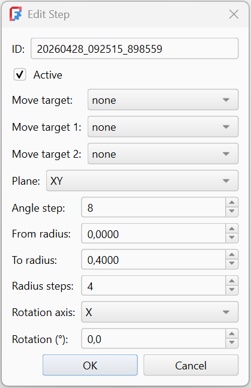
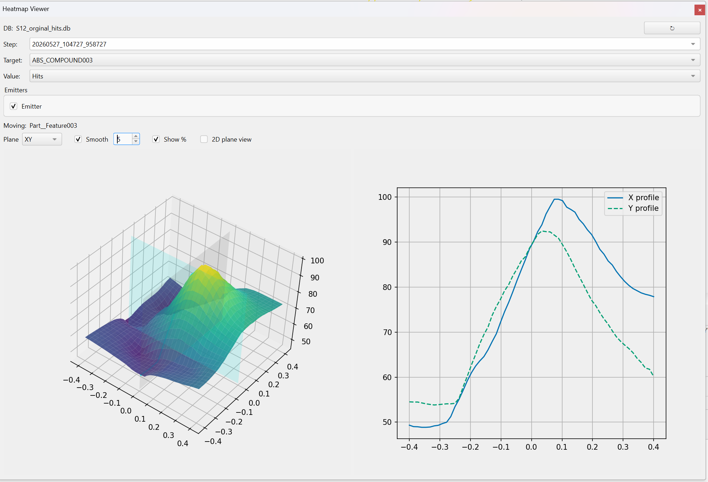

<!-- ................ Scanner Batch Dialog ................... -->

##  Scanner

    The Batch Group tool allows running multiple simulation steps sequentially, typically for parameter scans, rotations, or systematic sweeps.
    A Batch Group is stored as an object in the document tree and managed through a dockable panel.

- `Add Step` Creates a new Step object and opens the Step Edit dialog.

- `Run` Executes all active steps in sequence.

- `Stop` Stops the batch execution gracefully.

- `Heatmap` Opens the Heatmap Viewer for inspecting accumulated batch results.

- `DB XYZ List` Opens a list view of stored XYZ scan data.

<!-- ................ Scanner Step Dialog ................... -->

    The Step Edit dialog is used to define and edit a single Batch Step within a Batch Group.
    Each step describes one scan or transformation operation applied during batch execution.

- `Move Targets`
  Defines which objects are affected by the step.
  Move Target / Move Target 1 / Move Target 2
  Select up to three objects to be moved or scanned.
  At least one target must be selected

- `Plane` Selects the primary scan plane:
  XY
  XZ
  YZ

  The selected plane also determines the default rotation axis.

#### Sweep Parameters

- `Range` 1 – 360. Controls angular resolution

- `From Radius` Start radius of the scan.

- `To Radius` End radius of the scan.

- `Radius Steps` Number of radial steps between start and end radius.

- `Rotation Axis` Axis around which extra rotation is applied. Automatically synchronized with the selected plane.

- `Rotation (°)` Fixed rotation angle applied to the target.

> Data is stored in a SQLite database file located in the same directory as the installed module folder.  
> This file is created automatically and persists between sessions.

<!-- ................ Scanner Heatmap plot ................... -->

##  HeatmapPlot

    The Heatmap Viewer provides post‑processing visualization of batch scan results stored in the local database.
    It is primarily used to analyze absorber hits and accumulated beam power over scanned parameter spaces.

- `Reload` Reloads document structure from the database

- `Step` Selects the scan step to visualize

- `Target` Selects the scanned target object.

- `Value` Selects which quantity is visualized. Hits — number of ray hits. Power In — incoming power at the hit. Power Out — remaining power after interaction.

- `Emitters` Lists all emitters associated with the selected document and target.

### Plot Options

- `Plane` Selects projection plane:

- `Clickable surfaces` Enables interactive selection on the heatma

- `Smooth` Enables spatial smoothing of the data.

- `Strength` Controls smoothing strength.

- `Show %` Normalizes values to percentage of the maximum.

- `2D plane view` Enables interactive 2D slice view.

- _(Clickable surfaces)_  
  When enabled, allows clicking directly on the plot to probe positions and trigger new scans.

### Visualization

- **3D Heatmap**  
  Displays spatial distribution of the selected value.

- **Cross-section profiles**  
  Shows X and Y profiles of the selected plane (right-side plot).

- **Interactive probing**  
  Clicking in 2D mode allows direct inspection of specific positions and triggers trace evaluation.

