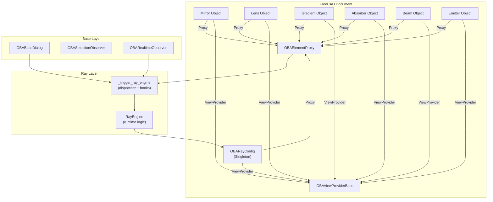
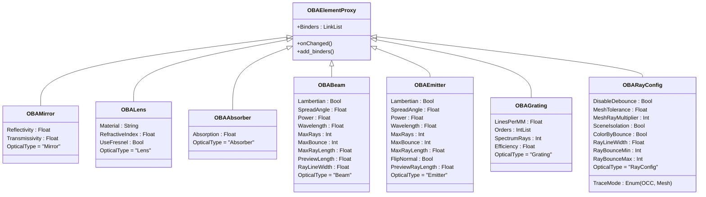
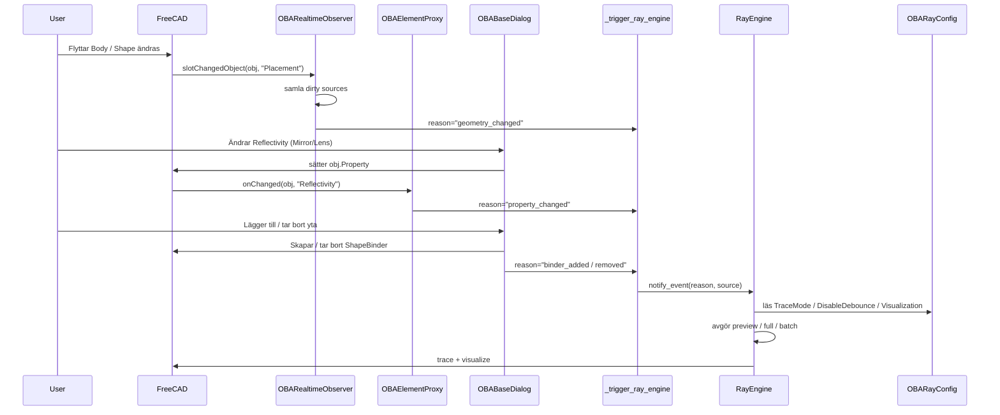

```mermaid
flowchart TD
subgraph FreeCAD_Document["FreeCAD Document"]
Mirror[Mirror Object]
Lens[Lens Object]
Gradient[Gradient Object]
Absorber[Absorber Object]
Beam[Beam Object]
Emitter[Emitter Object]

RayConfig["OBARayConfig<br/>(Singleton)"]

        Mirror -->|Proxy| OBAElementProxy
        Lens -->|Proxy| OBAElementProxy
        Gradient -->|Proxy| OBAElementProxy
        Absorber -->|Proxy| OBAElementProxy
        Beam -->|Proxy| OBAElementProxy
        Emitter -->|Proxy| OBAElementProxy
        RayConfig -->|Proxy| OBAElementProxy

        Mirror -->|ViewProvider| OBAViewProviderBase
        Lens -->|ViewProvider| OBAViewProviderBase
        Gradient -->|ViewProvider| OBAViewProviderBase
        Absorber -->|ViewProvider| OBAViewProviderBase
        Beam -->|ViewProvider| OBAViewProviderBase
        Emitter -->|ViewProvider| OBAViewProviderBase
        RayConfig -->|ViewProvider| OBAViewProviderBase
    end

    subgraph Base_Layer["Base Layer"]
        OBAElementProxy
        OBAViewProviderBase
        OBABaseDialog
        OBASelectionObserver
        OBARealtimeObserver
    end

    subgraph Ray_Layer["Ray Layer"]
        Dispatcher["_trigger_ray_engine<br/>(dispatcher + hooks)"]
        RayEngine["RayEngine<br/>(runtime logic)"]
        RayConfig
    end

    OBARealtimeObserver --> Dispatcher
    OBAElementProxy --> Dispatcher
    OBABaseDialog --> Dispatcher

    Dispatcher --> RayEngine
    RayEngine --> RayConfig

```

```mermaid
classDiagram
    %% =========================
    %% Base
    %% =========================
    class OBAElementProxy {
        +Binders : LinkList
        +onChanged()
        +add_binders()
    }

    %% =========================
    %% Optical Elements
    %% =========================

    OBAElementProxy <|-- OBAMirror
    class OBAMirror {
        Reflectivity : Float
        Transmissivity : Float
        OpticalType = "Mirror"
    }

    OBAElementProxy <|-- OBALens
    class OBALens {
        Material : String
        RefractiveIndex : Float
        UseFresnel : Bool
        OpticalType = "Lens"
    }

    OBAElementProxy <|-- OBAAbsorber
    class OBAAbsorber {
        Absorption : Float
        OpticalType = "Absorber"
    }

    %% =========================
    %% Sources / Emitters
    %% =========================

    OBAElementProxy <|-- OBABeam
    class OBABeam {
        Lambertian : Bool
        SpreadAngle : Float
        Power : Float
        Wavelength : Float
        MaxRays : Int
        MaxBounce : Int
        MaxRayLength : Float
        PreviewLength : Float
        RayLineWidth : Float
        OpticalType = "Beam"
    }

    OBAElementProxy <|-- OBAEmitter
    class OBAEmitter {
        Lambertian : Bool
        SpreadAngle : Float
        Power : Float
        Wavelength : Float
        MaxRays : Int
        MaxBounce : Int
        MaxRayLength : Float
        FlipNormal : Bool
        PreviewRayLength : Float
        OpticalType = "Emitter"
    }

    %% =========================
    %% Diffractive elements
    %% =========================

    OBAElementProxy <|-- OBAGrating
    class OBAGrating {
        LinesPerMM : Float
        Orders : IntList
        SpectrumRays : Int
        Efficiency : Float
        OpticalType = "Grating"
    }

    %% =========================
    %% Ray configuration (singleton)
    %% =========================

    OBAElementProxy <|-- OBARayConfig
    class OBARayConfig {
        TraceMode : Enum(OCC, Mesh)
        DisableDebounce : Bool
        MeshTolerance : Float
        MeshRayMultiplier : Int
        SceneIsolation : Bool
        ColorByBounce : Bool
        RayLineWidth : Float
        RayBounceMin : Int
        RayBounceMax : Int
        OpticalType = "RayConfig"
    }
```

```mermaid

sequenceDiagram
    participant User
    participant FreeCAD
    participant RealtimeObs as OBARealtimeObserver
    participant Proxy as OBAElementProxy
    participant Dialog as OBABaseDialog
    participant Dispatcher as _trigger_ray_engine
    participant Engine as RayEngine
    participant Config as OBARayConfig

    %% --- Geometry change ---
    User ->> FreeCAD: Flyttar Body / Shape ändras
    FreeCAD ->> RealtimeObs: slotChangedObject(obj, "Placement")
    RealtimeObs ->> RealtimeObs: samla dirty sources
    RealtimeObs ->> Dispatcher: reason="geometry_changed"

    %% --- Property change ---
    User ->> Dialog: Ändrar Reflectivity (Mirror/Lens)
    Dialog ->> FreeCAD: sätter obj.Property
    FreeCAD ->> Proxy: onChanged(obj, "Reflectivity")
    Proxy ->> Dispatcher: reason="property_changed"

    %% --- Binder UI ---
    User ->> Dialog: Lägger till / tar bort yta
    Dialog ->> FreeCAD: Skapar / tar bort ShapeBinder
    Dialog ->> Dispatcher: reason="binder_added / removed"

    %% --- Ray handling ---
    Dispatcher ->> Engine: notify_event(reason, source)
    Engine ->> Config: läs TraceMode / DisableDebounce / Visualization
    Engine ->> Engine: avgör preview / full / batch
    Engine ->> FreeCAD: trace + visualize


```
